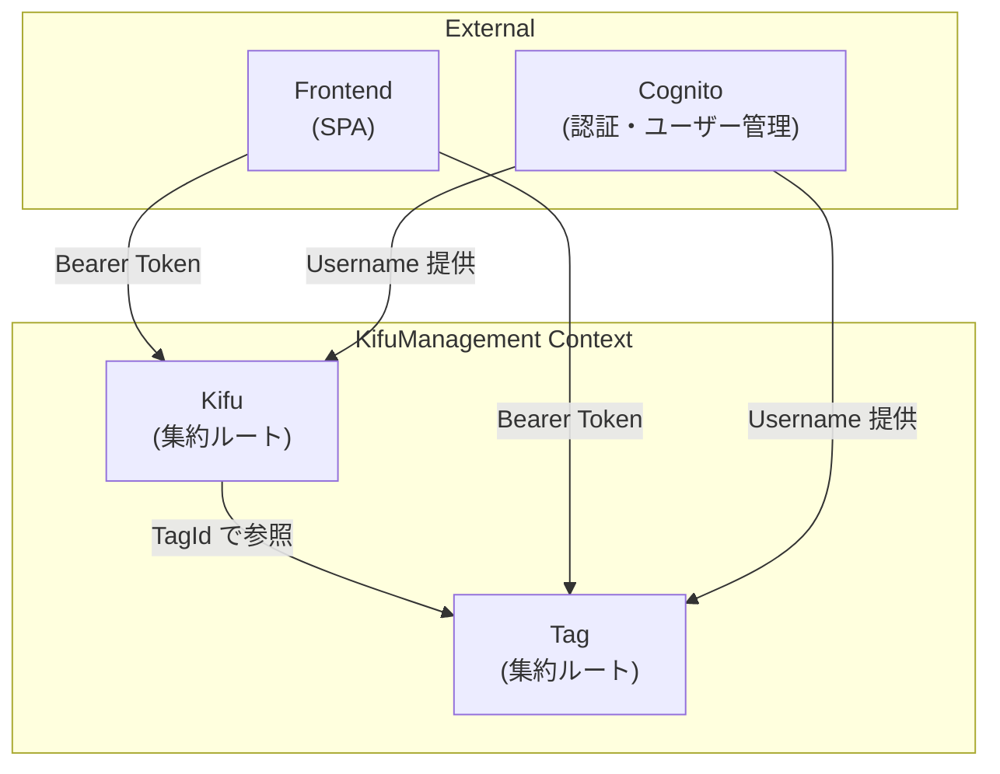
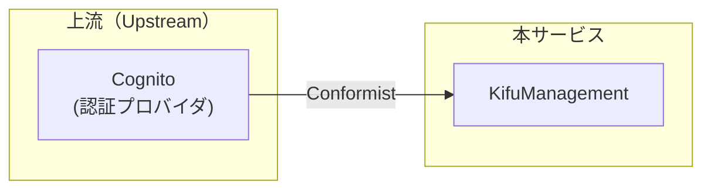
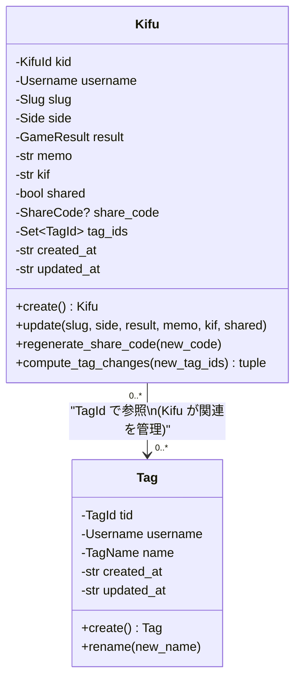

# ドメインモデル

## 概要

本ドキュメントは、Main API（棋譜管理サービス）のドメインモデルを定義する。
親リポジトリの `docs/openapi_main.yaml` および `docs/user_stories.md` を入力として、
DDD（ドメイン駆動設計）に基づくドメインの構造化を行う。

## Bounded Context（境界づけられたコンテキスト）

### KifuManagement コンテキスト

本サービスは単一の Bounded Context「**KifuManagement**」として定義する。

**理由:**
- データモデルが3テーブル（kifus, tags, kifu_tags）で密結合している
- Tag は Kifu の分類のためだけに存在し、独立したドメインを形成しない
- 共有機能（share_code）は Kifu エンティティの振る舞いの一部
- ユーザー管理はこのサービス内では最小限（Cognito の外部IDを参照するのみ）

### コンテキストマップ

- **Cognito → KifuManagement**: Conformist パターン
  - 本サービスは Cognito のユーザーモデル（username, email 等）をそのまま受け入れる
  - Cognito のデータ構造に適応する側であり、変換層（ACL）は不要

## ユビキタス言語（Ubiquitous Language）

ドメイン内で使用する用語を統一する。コード中の変数名・クラス名・メソッド名はこの用語に従う。

| 日本語 | English (コード上の名前) | 定義 |
|---|---|---|
| 棋譜 | Kifu | 将棋の対局記録。KIF形式のテキストデータとメタデータを持つ |
| 棋譜ID | KifuId | 棋譜を一意に識別する12文字の英数字ID |
| スラッグ | Slug | 棋譜の階層パス（例: `year/2024/January/game.kif`） |
| 手番 | Side | 対局者の手番（先手/後手/なし） |
| 対局結果 | GameResult | 対局の結果（勝ち/負け/千日手/持将棋/なし） |
| KIFデータ | kif (フィールド名) | KIF形式の棋譜テキストデータ |
| メモ | memo | 棋譜に付与する自由テキスト |
| 共有 | shared | 棋譜の公開フラグ |
| 共有コード | ShareCode | 公開された棋譜にアクセスするための36文字のランダムコード |
| タグ | Tag | 棋譜を分類するためのラベル |
| タグID | TagId | タグを一意に識別する12文字の英数字ID |
| タグ名 | TagName | タグの表示名（1-127文字） |
| ユーザー名 | Username | Cognito から取得するユーザー識別子 |
| エクスプローラー | Explorer | スラッグの階層構造をフォルダ/ファイルとして表示する機能 |

## 集約の概要

### Kifu 集約

- **集約ルート**: `Kifu`
- **責務**: 棋譜データの管理、共有機能、タグ関連付けの制御
- **不変条件**:
  - Slug は1-255文字、先頭 `/` 禁止、`.kif` 拡張子必須
  - Side は有効な値（none/sente/gote）のみ
  - GameResult は有効な値（none/win/loss/sennichite/jishogi）のみ
  - KIF データは必須（空文字禁止）
  - ユーザーごとの棋譜数は KIFU_MAX（2000）以下
  - (username, slug) の組み合わせは一意
  - share_code は shared=true のとき自動生成、shared=false のとき null

### Tag 集約

- **集約ルート**: `Tag`
- **責務**: タグの管理
- **不変条件**:
  - タグ名は1-127文字
  - ユーザーごとのタグ数は TAG_MAX（50）以下
  - (username, name) の組み合わせは一意

### 集約間の関係

- Kifu は `Set[TagId]` として関連するタグの ID のみを保持する
- タグの実体（名前等）は Tag 集約が管理する
- Kifu のタグ関連付け変更は Kifu 集約のメソッド `compute_tag_changes()` で計算する
- 集約境界を越えるため、タグの存在確認はアプリケーション層のユースケースが行う
