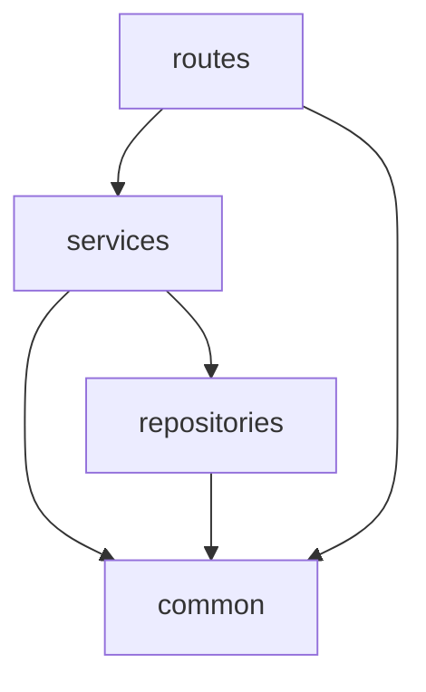

# ディレクトリ構成

## 概要

メイン API は Lambdalith 構成（単一 Lambda 関数で全エンドポイントを処理）を採用する。AWS Lambda Powertools for Python の `APIGatewayRestResolver` + `Router` によりファイル分割しつつ、単一のエントリポイントにまとめる。

アプリケーションコードは 3 レイヤー + 共通モジュールで構成する。

---

## ディレクトリツリー

```
Backend/main/
├── template.yaml            # SAM テンプレート
├── requirements.txt         # 本番依存パッケージ
├── requirements-dev.txt     # 開発用依存パッケージ
├── pytest.ini               # pytest 設定
├── migrations/
│   ├── migrate.py           # マイグレーション実行スクリプト
│   ├── requirements.txt     # マイグレーション用依存パッケージ
│   └── sql/
│       ├── 001_create_tables.sql
│       └── 002_create_indexes.sql
├── src/
│   ├── app.py               # Lambda ハンドラ (エントリポイント)
│   ├── routes/
│   │   ├── __init__.py
│   │   ├── users.py         # /users/* ルート定義
│   │   ├── kifus.py         # /kifus/* ルート定義
│   │   ├── shared.py        # /shared/* ルート定義 (認証不要)
│   │   └── tags.py          # /tags/* ルート定義
│   ├── services/
│   │   ├── __init__.py
│   │   ├── user_service.py  # ユーザー管理ビジネスロジック
│   │   ├── kifu_service.py  # 棋譜管理ビジネスロジック
│   │   └── tag_service.py   # タグ管理ビジネスロジック
│   ├── repositories/
│   │   ├── __init__.py
│   │   ├── db.py            # Aurora DSQL 接続の初期化
│   │   ├── kifu_repository.py  # 棋譜データアクセス
│   │   └── tag_repository.py   # タグデータアクセス
│   └── common/
│       ├── __init__.py
│       ├── auth.py           # Access Token からの username 取得
│       ├── config.py         # 環境変数の読み込み
│       ├── exceptions.py     # カスタム例外クラス
│       ├── id_generator.py   # ランダム ID / share_code 生成
│       └── datetime_util.py  # 日時ユーティリティ
└── tests/
    ├── __init__.py
    ├── conftest.py           # 共通フィクスチャ
    ├── test_routes.py        # ルート層の統合テスト
    ├── test_services.py      # サービス層の単体テスト
    └── test_repositories.py  # リポジトリ層の単体テスト
```

---

## レイヤー責務

### routes 層

HTTP リクエストの受付とレスポンスの返却を担当する。

- Lambda Powertools の `Router` クラスを使用し、機能単位でファイルを分割する
- リクエストボディの JSON パース（`app.current_event.json_body`）
- パスパラメータ・クエリパラメータの取得
- サービス層の呼び出し
- ステータスコードの制御（`Response` オブジェクトで 201, 204 等を返す）
- **ビジネスロジックを含めない**

### services 層

ビジネスロジックの実装を担当する。

- 入力バリデーション（slug 形式、タグ名長さ、上限チェック等）
- 複数リポジトリの協調（例: 棋譜作成時のタグ関連付け）
- ID 生成、日時取得
- レスポンス用データの組み立て（DB レコード → API レスポンス形式への変換）
- カスタム例外の送出

### repositories 層

Aurora DSQL（PostgreSQL）への CRUD 操作を担当する。

- psycopg を使用した SQL クエリの実行をカプセル化する
- SELECT, INSERT, UPDATE, DELETE 操作
- **ビジネスロジックを含めない**

### common 層

横断的関心事を担当する。全レイヤーから参照可能。

- 認証情報の取得
- 環境変数管理
- 例外クラス定義
- ユーティリティ関数（ID 生成、日時処理）

---

## 依存関係ルール



- 上位レイヤーから下位レイヤーへの参照のみ許可する
- 下位レイヤーから上位レイヤーへの参照は禁止する（例: repositories から services を import しない）
- common は全レイヤーから参照可能
- 同一レイヤー内のモジュール間参照は許可する（例: `kifu_service.py` から `tag_service.py` の関数を呼ぶ）

---

## 各ファイルの責務

### エントリポイント

| ファイル | 責務 |
|---------|------|
| `app.py` | `APIGatewayRestResolver` の初期化、Router の include、例外ハンドラの登録、`lambda_handler` 関数の定義 |

### routes 層

| ファイル | 責務 | 含むエンドポイント |
|---------|------|-----------------|
| `users.py` | ユーザー関連ルート | `GET /users/me`, `DELETE /users/me` |
| `kifus.py` | 棋譜関連ルート | `GET /kifus/recent`, `POST /kifus`, `GET /kifus/explorer`, `GET /kifus/<kid>`, `PUT /kifus/<kid>`, `DELETE /kifus/<kid>`, `PUT /kifus/<kid>/share-code` |
| `shared.py` | 共有棋譜ルート（認証不要） | `GET /shared/<share_code>` |
| `tags.py` | タグ関連ルート | `GET /tags`, `POST /tags`, `GET /tags/<tid>`, `PUT /tags/<tid>`, `DELETE /tags/<tid>` |

### services 層

| ファイル | 責務 |
|---------|------|
| `user_service.py` | Cognito からのユーザー情報取得、パスワード検証、アカウント削除（Cognito + DB データの一括削除） |
| `kifu_service.py` | 棋譜の CRUD、slug バリデーション、エクスプローラーのフォルダ/ファイル分類、共有棋譜取得、share_code 再生成、タグ関連の同期 |
| `tag_service.py` | タグの CRUD、タグ名バリデーション、タグ別棋譜一覧 |

### repositories 層

| ファイル | 責務 |
|---------|------|
| `db.py` | Aurora DSQL 接続の初期化（aurora-dsql-python-connector + psycopg）。他のリポジトリモジュールがこの接続を参照する |
| `kifu_repository.py` | kifus テーブルと kifu_tags テーブルの CRUD 操作 |
| `tag_repository.py` | tags テーブルの CRUD 操作、タグ別棋譜の取得 |

### common 層

| ファイル | 責務 |
|---------|------|
| `auth.py` | `app.current_event` から `cognito:username` を取得する関数 |
| `config.py` | 環境変数（`DSQL_CLUSTER_ENDPOINT`, `KIFU_MAX`, `TAG_MAX`, `USER_POOL_ID`, `CLIENT_ID`）の読み込みとデフォルト値管理 |
| `exceptions.py` | カスタム例外クラス（`AppError`, `NotFoundError`, `ValidationError`, `ConflictError`, `LimitExceededError`, `AuthenticationError`） |
| `id_generator.py` | 棋譜 ID・タグ ID（12 文字）、共有コード（36 文字）の英数字ランダム生成 |
| `datetime_util.py` | ISO 8601 UTC 形式の現在日時文字列を生成する関数 |

---

## 依存パッケージ

### `requirements.txt`（本番）

```
aws-lambda-powertools
boto3
aurora-dsql-python-connector
psycopg[binary,pool]
```

> `boto3` は Lambda 実行環境にプリインストールされているが、ローカル開発・テスト用に明示的に含める。Cognito 操作で使用する。
> `aurora-dsql-python-connector` は IAM 認証トークンの自動生成を行う。`psycopg` は PostgreSQL ドライバ。

### `requirements-dev.txt`（開発）

```
-r requirements.txt
pytest
pytest-postgresql
moto[cognitoidp]
```
