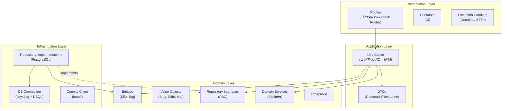

# アーキテクチャ

## 概要

本サービスは DDD に基づく4層アーキテクチャを採用する。
各層は明確な責務を持ち、依存方向は外側から内側への一方向のみ許可される。

## 4層アーキテクチャ



## 依存ルール

| 層 | 依存してよい層 | 依存してはならない層 |
|---|---|---|
| Presentation | Application, Domain, Common | Infrastructure（直接参照禁止、Container 経由） |
| Application | Domain, Common | Presentation, Infrastructure |
| Domain | Common（id_generator のみ） | Presentation, Application, Infrastructure |
| Infrastructure | Domain, Common | Presentation, Application |
| Common | なし（純粋ユーティリティ） | すべての層 |

### 依存性逆転（DIP）の適用

Repository パターンで依存性逆転を実現する:

```
Application Layer → Domain Layer (Repository Interface = ABC)
                           ↑ implements
Infrastructure Layer (Repository Implementation = PostgreSQL)
```

- Application 層は Domain 層の `KifuRepository`（ABC）に依存する
- Infrastructure 層が `PostgresKifuRepository` として実装を提供する
- Presentation 層の `container.py` が実装をインスタンス化し、Use Case に注入する

## 各層の責務

### Presentation Layer（プレゼンテーション層）

**場所:** `src/presentation/`

**責務:**
- HTTP リクエストの受信とレスポンスの返却
- Lambda Powertools Router によるルーティング
- リクエストパラメータの抽出（パスパラメータ、クエリパラメータ、ボディ）
- Cognito claims からの Username 抽出
- Command DTO の組み立て
- Use Case の呼び出し
- Response DTO から JSON レスポンスへの変換
- ドメイン例外→HTTPステータスコードのマッピング
- DI コンテナによるオブジェクトの組み立て

**含まれないもの:** ビジネスロジック、バリデーション、データアクセス

### Application Layer（アプリケーション層）

**場所:** `src/application/`

**責務:**
- ユースケース（ビジネスフロー）の制御
- ドメインオブジェクトの生成・操作の調整
- リポジトリの呼び出し（永続化の指示）
- 集約境界を越えた整合性の確保（例: タグ存在確認→棋譜作成）
- リソース上限チェック（KIFU_MAX, TAG_MAX）
- Command/Response DTO の定義

**含まれないもの:** HTTP 処理、SQL クエリ、バリデーションルール

### Domain Layer（ドメイン層）

**場所:** `src/domain/`

**責務:**
- エンティティの定義（Kifu, Tag）とその振る舞い
- Value Object の定義と自己検証
- ドメインサービス（Explorer のフォルダ/ファイル分類ロジック）
- リポジトリインターフェースの定義（ABC）
- ドメイン例外の定義
- ドメインイベントの定義（将来用）

**厳格な制約:**
- 外部ライブラリへの依存禁止（boto3, psycopg, Lambda Powertools 等）
- IO 操作禁止（ネットワーク、ファイル、データベース）
- 純粋な Python のみ（dataclass, enum, abc, typing）
- 唯一の例外: `common.id_generator` の利用（ID 生成は横断的関心事）

### Infrastructure Layer（インフラストラクチャ層）

**場所:** `src/infrastructure/`

**責務:**
- リポジトリインターフェースの PostgreSQL 実装
- ドメインエンティティと DB レコード間の変換（マッピング）
- DB コネクション管理（Aurora DSQL + IAM 認証）
- Cognito API の呼び出し（boto3）
- DB 例外→ドメイン例外の変換（UniqueViolation → ConflictError）
- トランザクション管理

### Common（横断的関心事）

**場所:** `src/common/`

**責務:**
- 環境変数の読み込み（config.py）
- Cognito claims からの Username 抽出（auth.py）
- ID 生成（id_generator.py）

## ディレクトリ構造

```
src/
├── app.py                          # Lambda handler entry point
├── domain/
│   ├── __init__.py
│   ├── value_objects.py            # KifuId, TagId, Slug, Side, GameResult,
│   │                               # ShareCode, TagName, Username
│   ├── kifu.py                     # Kifu entity (aggregate root)
│   ├── tag.py                      # Tag entity (aggregate root)
│   ├── repositories.py             # KifuRepository(ABC), TagRepository(ABC)
│   ├── services.py                 # KifuExplorerService
│   ├── events.py                   # Domain events (placeholder)
│   └── exceptions.py               # DomainValidationError, EntityNotFoundError,
│                                    # ConflictError, LimitExceededError,
│                                    # AuthenticationError
├── application/
│   ├── __init__.py
│   ├── kifu_use_cases.py           # 8 use case classes
│   ├── tag_use_cases.py            # 5 use case classes
│   ├── user_use_cases.py           # 2 use case classes
│   └── dto.py                      # All Command/Response dataclasses
├── infrastructure/
│   ├── __init__.py
│   ├── db.py                       # Aurora DSQL connection pool
│   ├── kifu_repository.py          # PostgresKifuRepository
│   ├── tag_repository.py           # PostgresTagRepository
│   └── cognito_client.py           # CognitoClient (boto3)
├── presentation/
│   ├── __init__.py
│   ├── container.py                # DI: wire repos → use cases
│   ├── exception_handlers.py       # Domain exception → HTTP response
│   └── routes/
│       ├── __init__.py
│       ├── kifus.py                # /kifus endpoints
│       ├── tags.py                 # /tags endpoints
│       ├── users.py                # /users endpoints
│       └── shared.py               # /shared endpoints
└── common/
    ├── __init__.py
    ├── config.py                   # DSQL_CLUSTER_ENDPOINT, KIFU_MAX, etc.
    ├── auth.py                     # get_username(event)
    └── id_generator.py             # generate_id(), generate_share_code()
```

## DI コンテナの設計

AWS Lambda ではコンテナフレームワーク（Spring, Dagger 等）を使わず、
シンプルな関数ベースの DI を採用する。

```python
# presentation/container.py (conceptual)
from infrastructure.db import get_connection
from infrastructure.kifu_repository import PostgresKifuRepository
from infrastructure.tag_repository import PostgresTagRepository
from infrastructure.cognito_client import CognitoClient
from application.kifu_use_cases import CreateKifuUseCase, ...

# Singleton-like instances (created once per Lambda cold start)
_kifu_repo = None
_tag_repo = None

def _get_kifu_repo() -> PostgresKifuRepository:
    global _kifu_repo
    if _kifu_repo is None:
        _kifu_repo = PostgresKifuRepository(get_connection)
    return _kifu_repo

def get_create_kifu_use_case() -> CreateKifuUseCase:
    return CreateKifuUseCase(_get_kifu_repo(), _get_tag_repo())
```

- Lambda のコールドスタート時にリポジトリがインスタンス化される
- リポジトリは `get_connection` 関数への参照を保持（コネクションプール対応）
- Use Case はリクエストごとに生成（軽量なので問題ない）

## 例外マッピング

```python
# presentation/exception_handlers.py (conceptual)
EXCEPTION_STATUS_MAP = {
    DomainValidationError: 400,
    EntityNotFoundError: 404,
    ConflictError: 409,
    LimitExceededError: 400,
    AuthenticationError: 403,
}
```

## AWS Lambda Powertools の利用範囲

| 機能 | 利用する層 |
|---|---|
| `APIGatewayRestResolver`, `Router` | Presentation |
| `Logger` | Presentation (app.py) |
| `Tracer` | Application (use case), Infrastructure (repository) |
| `Response` | Presentation |

**Domain 層では Lambda Powertools を一切使用しない。**

## SAM テンプレートとの関係

`template.yaml` の変更は最小限:
- `CodeUri: src/` — 変更なし（src/ 配下の構造変更はビルドに影響しない）
- `Handler: app.lambda_handler` — 変更なし
- 環境変数 — 変更なし
- IAM ポリシー — 変更なし
