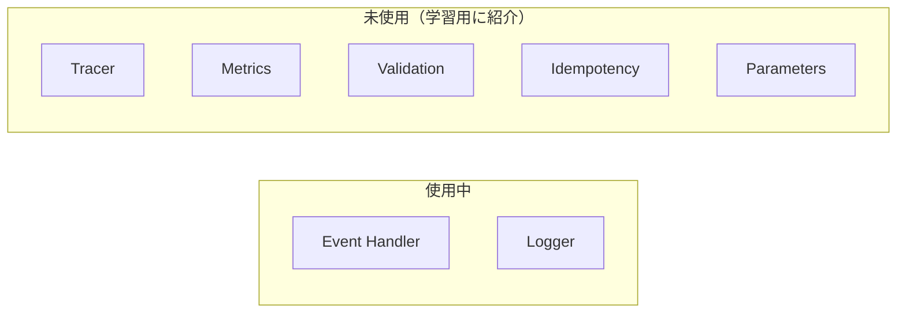

# AWS Lambda Powertools for Python 学習ガイド

## このガイドについて

本ガイドは、ShogiProject の Backend コードを題材に、AWS Lambda Powertools for Python の機能と使い方を学ぶためのものです。

**前提知識**: Python の十分な知識・経験があること
**目的**: Powertools でどんなことができるか、ざっくりどんな文法なのかを把握し、AI への指示や設計判断に活かせるようにする

## 目次

| # | ファイル | 内容 |
|---|---------|------|
| 01 | [01_overview.md](01_overview.md) | Powertools とは何か・全体像・設計思想 |
| 02 | [02_event_handler.md](02_event_handler.md) | **Event Handler** — API ルーティングの中核機能（本プロジェクトで使用中） |
| 03 | [03_logger.md](03_logger.md) | **Logger** — 構造化ロギング（本プロジェクトで使用中） |
| 04 | [04_tracer.md](04_tracer.md) | **Tracer** — AWS X-Ray による分散トレーシング |
| 05 | [05_metrics.md](05_metrics.md) | **Metrics** — CloudWatch カスタムメトリクス |
| 06 | [06_other_utilities.md](06_other_utilities.md) | その他のユーティリティ（Validation, Idempotency, Parameters 等） |

## ShogiProject での使用状況

本プロジェクトでは、以下の Powertools 機能を使用しています：

- **Event Handler**（APIGatewayRestResolver / Router）— API ルーティングの全体
- **Logger** — エラーログ

02〜03 は「プロジェクトのコードを読む」視点、04〜06 は「将来使うかもしれない機能を知る」視点で書かれています。
