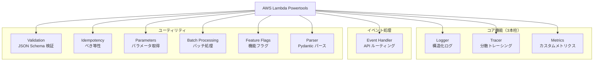

# 01. AWS Lambda Powertools for Python — 全体像

## Powertools とは

AWS Lambda Powertools for Python は、Lambda 関数にサーバーレスのベストプラクティスを簡単に組み込むための**公式ユーティリティライブラリ**です。AWS が開発・メンテナンスしています。

ポイント:
- **Lambda 専用** — Lambda 以外の環境では動かない（動かす必要もない）
- **段階的に導入可能** — 1 機能だけ使うのも OK。全部入りではない
- **薄いラッパー** — 裏では AWS SDK や X-Ray SDK を呼んでいるだけで、魔法はない

## インストール

```bash
pip install aws-lambda-powertools
```

`requirements.txt` に書くだけ。SAM/CDK でデプロイすれば Lambda Layer としても利用可能。

## 機能一覧



### コア機能（Observability の 3 本柱）

| 機能 | 一言で | 裏側 |
|------|-------|------|
| **Logger** | 構造化 JSON ログ | Python 標準 logging を拡張 |
| **Tracer** | リクエスト追跡 | AWS X-Ray SDK のラッパー |
| **Metrics** | カスタムメトリクス | CloudWatch EMF (Embedded Metric Format) |

### Event Handler

API Gateway / ALB / Function URL からのイベントを、Flask ライクなルーティングで処理する。

### ユーティリティ群

| 機能 | 一言で |
|------|-------|
| **Validation** | JSON Schema でイベントを検証 |
| **Idempotency** | DynamoDB を使って重複実行を防止 |
| **Parameters** | SSM / Secrets Manager から値を取得＋キャッシュ |
| **Batch Processing** | SQS / Kinesis の部分失敗処理 |
| **Parser** | Pydantic でイベントをパース |
| **Feature Flags** | AppConfig ベースの機能フラグ |

## 環境変数による設定

Powertools は環境変数で動作を制御します。SAM テンプレートの `Environment.Variables` に書くのが一般的です。

| 変数 | デフォルト | 対象 |
|------|---------|------|
| `POWERTOOLS_SERVICE_NAME` | `service_undefined` | 全機能共通のサービス名 |
| `POWERTOOLS_LOG_LEVEL` | `INFO` | Logger のログレベル |
| `POWERTOOLS_METRICS_NAMESPACE` | なし | Metrics の名前空間 |
| `POWERTOOLS_TRACE_DISABLED` | `false` | Tracer の無効化 |
| `POWERTOOLS_DEV` | `false` | 開発モード（ログを見やすく表示等） |

## 典型的な Lambda 関数の構成

Powertools をフル活用した場合の Lambda 関数のイメージ:

```python
from aws_lambda_powertools import Logger, Tracer, Metrics
from aws_lambda_powertools.metrics import MetricUnit

logger = Logger()
tracer = Tracer()
metrics = Metrics()

@logger.inject_lambda_context    # Lambda コンテキスト情報をログに注入
@tracer.capture_lambda_handler   # X-Ray トレースを自動生成
@metrics.log_metrics             # メトリクスをフラッシュ
def lambda_handler(event, context):
    logger.info("Processing request")
    metrics.add_metric(name="RequestCount", unit=MetricUnit.Count, value=1)
    return {"statusCode": 200}
```

3 つのデコレータを重ねるだけで、ログ・トレース・メトリクスが整う。
ただし、全部使う必要はない。ShogiProject のように **Event Handler + Logger だけ**という構成も普通。

## 「Powertools を使わない場合」との比較

API Gateway からのリクエストをルーティングする処理を、Powertools なし/ありで比較:

### Powertools なし

```python
import json

def lambda_handler(event, context):
    path = event["path"]
    method = event["httpMethod"]

    if path == "/users/me" and method == "GET":
        return get_me(event)
    elif path.startswith("/kifus") and method == "POST":
        return create_kifu(event)
    # ... if/elif が延々と続く
    else:
        return {"statusCode": 404, "body": "Not Found"}

def get_me(event):
    username = event["requestContext"]["authorizer"]["claims"]["cognito:username"]
    # ...
    return {
        "statusCode": 200,
        "headers": {"Content-Type": "application/json", "Access-Control-Allow-Origin": "*"},
        "body": json.dumps(user),
    }
```

### Powertools あり（ShogiProject の実際のコード）

```python
from aws_lambda_powertools.event_handler import APIGatewayRestResolver, CORSConfig

app = APIGatewayRestResolver(
    cors=CORSConfig(allow_origin="*"),
)

@app.get("/users/me")
def get_me():
    claims = app.current_event.request_context.authorizer.claims
    # ...
    return user  # dict を返すだけで JSON + 200 + CORS ヘッダが自動付与

def lambda_handler(event, context):
    return app.resolve(event, context)
```

**差分のまとめ**:
- if/elif の分岐 → デコレータでルーティング
- CORS ヘッダの手動付与 → `CORSConfig` で自動
- `json.dumps` + レスポンス構築 → dict を return するだけ

## 次のステップ

- [02_event_handler.md](02_event_handler.md) — ShogiProject で最も使われている Event Handler を詳しく見る
