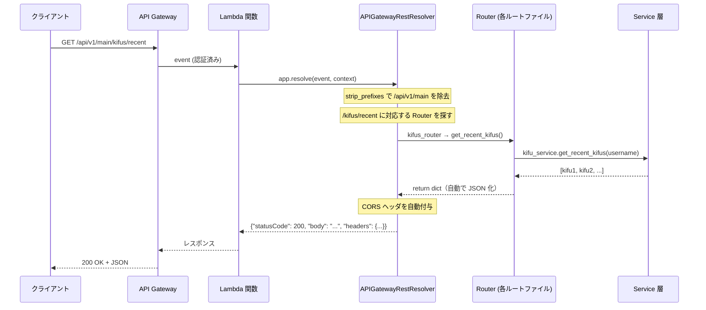
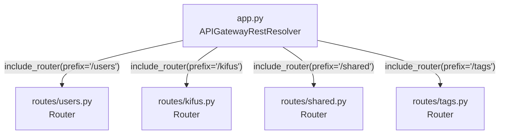
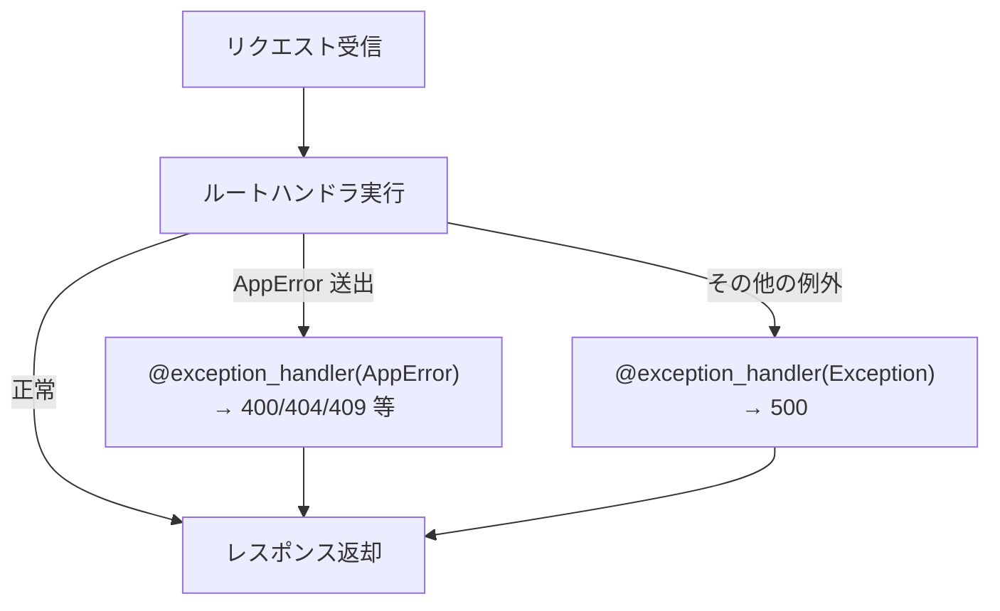

# 02. Event Handler — API ルーティング

ShogiProject で最も活用されている機能。API Gateway からのイベントを Flask ライクなルーティングで処理する。

## 全体像



## APIGatewayRestResolver — メインのリゾルバ

ShogiProject の `src/app.py` から抜粋:

```python
from aws_lambda_powertools.event_handler import APIGatewayRestResolver, CORSConfig, Response

app = APIGatewayRestResolver(
    strip_prefixes=["/api/v1/main"],
    cors=CORSConfig(
        allow_origin="*",
        allow_headers=["Content-Type", "Authorization"],
        allow_credentials=False,
    ),
)
```

### 主要なコンストラクタ引数

| 引数 | 説明 |
|-----|------|
| `strip_prefixes` | URL パスから除去するプレフィックスのリスト。ステージ名やバージョンパスを除去するのに使う |
| `cors` | CORS 設定。`CORSConfig` オブジェクトを渡す |
| `enable_validation` | `True` にすると Pydantic によるリクエスト/レスポンスの自動バリデーションが有効になる |

### リゾルバの種類

用途に応じて使い分ける:

| リゾルバ | 対象 |
|---------|------|
| `APIGatewayRestResolver` | API Gateway REST API (v1) ← ShogiProject はこれ |
| `APIGatewayHttpResolver` | API Gateway HTTP API (v2) |
| `ALBResolver` | Application Load Balancer |
| `LambdaFunctionUrlResolver` | Lambda Function URL |

使い方はどれもほぼ同じ。クラス名を差し替えるだけ。

## Router — ルートの分割

大きい API を 1 ファイルに書くと見通しが悪いので、**Router** で分割する。
Flask の Blueprint に相当する概念。



### app.py 側（統合）

```python
from src.routes.users import router as users_router
from src.routes.kifus import router as kifus_router

app.include_router(users_router, prefix="/users")
app.include_router(kifus_router, prefix="/kifus")
```

### routes/tags.py 側（定義）

```python
from aws_lambda_powertools.event_handler.api_gateway import Router, Response

router = Router()

@router.get("/")
def get_tags():
    username = get_username(router)
    tags = tag_service.get_tags(username)
    return {"tags": tags}

@router.post("/")
def create_tag():
    username = get_username(router)
    body = router.current_event.json_body or {}
    tag = tag_service.create_tag(username, body)
    return Response(
        status_code=201,
        content_type="application/json",
        body=json.dumps(tag),
    )
```

`app.include_router(tags_router, prefix="/tags")` と組み合わせると:
- `@router.get("/")` → `GET /tags`
- `@router.post("/")` → `POST /tags`

## HTTP メソッドデコレータ

```python
@router.get("/path")       # GET
@router.post("/path")      # POST
@router.put("/path")       # PUT
@router.delete("/path")    # DELETE
@router.patch("/path")     # PATCH
```

Flask とほぼ同じ。

## パスパラメータ

URL の一部を変数として受け取る:

```python
@router.get("/<kid>")
def get_kifu(kid: str):
    # /kifus/abc123 → kid = "abc123"
    return kifu_service.get_kifu(username, kid)

@router.put("/<kid>")
def update_kifu(kid: str):
    body = router.current_event.json_body or {}
    return kifu_service.update_kifu(username, kid, body)
```

`<変数名>` で囲むとパスパラメータになり、関数の引数にバインドされる。

## リクエスト情報の取得

### current_event — リクエスト全体へのアクセス

`router.current_event`（または `app.current_event`）で、API Gateway のイベントオブジェクトに型付きでアクセスできる。

```python
# JSON ボディ（dict に自動パース済み）
body = router.current_event.json_body

# クエリパラメータ
path = router.current_event.get_query_string_value("path", default_value="")

# 認証情報（Cognito Authorizer のクレーム）
claims = router.current_event.request_context.authorizer.claims
username = claims["cognito:username"]

# ヘッダ
auth_header = router.current_event.get_header_value("Authorization")
```

### 認証情報はどこから来るのか？ — Cognito Authorizer の前提

`claims` が取得できるのは、**API Gateway 側で Cognito Authorizer が設定されている**から。
Powertools は認証を行わない。Lambda に届く前に API Gateway が認証を済ませ、検証済みのクレーム情報を event に埋め込んでくれる。

```mermaid
sequenceDiagram
    participant Client as クライアント
    participant APIGW as API Gateway
    participant Cognito as Cognito User Pool
    participant Lambda as Lambda 関数

    Client->>APIGW: GET /kifus<br/>Authorization: Bearer &lt;IDトークン&gt;
    APIGW->>Cognito: トークン検証
    Cognito-->>APIGW: OK + クレーム情報
    Note over APIGW: event.requestContext.authorizer.claims に<br/>クレーム情報をセット
    APIGW->>Lambda: event（claims 付き）
    Note over Lambda: Powertools は claims を<br/>型付きプロパティで読むだけ
```

つまり:
- **Cognito Authorizer なし** → `request_context.authorizer` 自体が存在せずエラーになる
- **Powertools の役割** → 生の `event["requestContext"]["authorizer"]["claims"]["cognito:username"]` を `router.current_event.request_context.authorizer.claims["cognito:username"]` という型付きアクセスに変換しているだけ

ShogiProject では SAM テンプレート（`template.yaml`）で以下のように設定されている:

```yaml
Auth:
  DefaultAuthorizer: CognitoAuthorizer
  Authorizers:
    CognitoAuthorizer:
      UserPoolArn: !ImportValue ...
```

認証不要のエンドポイント（共有棋譜の取得等）は個別に `Auth: Authorizer: NONE` を指定している。

### ShogiProject での認証パターン

認証情報の取得を共通関数に切り出している:

```python
# common/auth.py
from aws_lambda_powertools.event_handler import APIGatewayRestResolver

def get_username(app: APIGatewayRestResolver) -> str:
    return app.current_event.request_context.authorizer.claims["cognito:username"]
```

各ルートハンドラから呼び出す:

```python
@router.get("/recent")
def get_recent_kifus():
    username = get_username(router)  # Router も APIGatewayRestResolver も同じ I/F
    return kifu_service.get_recent_kifus(username)
```

## レスポンスの返し方

### パターン 1: dict を return（最も簡単）

```python
@router.get("/")
def get_tags():
    return {"tags": tags}
```

- ステータスコード: **200** （自動）
- Content-Type: `application/json`（自動）
- CORS ヘッダ: 自動付与
- body: dict が JSON 文字列に自動変換

**200 レスポンスならこれだけで十分。**

### パターン 2: Response オブジェクト（ステータスコードを指定したいとき）

```python
from aws_lambda_powertools.event_handler import Response

@router.post("/")
def create_tag():
    tag = tag_service.create_tag(username, body)
    return Response(
        status_code=201,
        content_type="application/json",
        body=json.dumps(tag),
    )
```

201 Created や 204 No Content を返したいときは `Response` を使う。

### パターン 3: 204 No Content

```python
@router.delete("/<tid>")
def delete_tag(tid: str):
    tag_service.delete_tag(username, tid)
    return Response(status_code=204, body="")
```

## 例外ハンドリング

`@app.exception_handler` で、特定の例外クラスをキャッチしてレスポンスに変換できる。

```python
# app.py
@app.exception_handler(AppError)
def handle_app_error(ex: AppError):
    return Response(
        status_code=ex.status_code,
        content_type="application/json",
        body=json.dumps({"message": ex.message}),
    )

@app.exception_handler(Exception)
def handle_unexpected_error(ex: Exception):
    logger.exception("Unexpected error")
    return Response(
        status_code=500,
        content_type="application/json",
        body=json.dumps({"message": "Internal server error"}),
    )
```



サービス層やリポジトリ層で例外を raise するだけで、適切な HTTP レスポンスに変換される:

```python
# services/kifu_service.py
raise NotFoundError("Kifu not found")     # → 404
raise ValidationError("Title is required") # → 400
raise LimitExceededError("Kifu limit")     # → 400
```

## CORS 設定

```python
cors = CORSConfig(
    allow_origin="*",                               # 許可するオリジン
    allow_headers=["Content-Type", "Authorization"], # 許可するヘッダ
    allow_credentials=False,                         # クレデンシャル許可
)
app = APIGatewayRestResolver(cors=cors)
```

これだけで、すべてのレスポンスに CORS ヘッダが自動付与される。
手動で `Access-Control-Allow-Origin` ヘッダを書く必要はない。

## Lambda ハンドラとの接続

```python
def lambda_handler(event, context):
    return app.resolve(event, context)
```

`app.resolve()` が:
1. event からパスとメソッドを取り出す
2. `strip_prefixes` でプレフィックスを除去
3. 対応するルートハンドラを探して実行
4. 戻り値を API Gateway 形式のレスポンス dict に変換して返す

## ShogiProject の Event Handler 構成まとめ

```
app.py (APIGatewayRestResolver)
├── strip_prefixes: ["/api/v1/main"]
├── cors: allow_origin="*"
├── exception_handler: AppError → 4xx, Exception → 500
│
├── /users  → routes/users.py
│   ├── GET  /me     → get_me()
│   └── DELETE /me   → delete_me()
│
├── /kifus  → routes/kifus.py
│   ├── GET  /recent       → get_recent_kifus()
│   ├── POST /             → create_kifu()
│   ├── GET  /explorer     → get_kifu_explorer()
│   ├── GET  /<kid>        → get_kifu()
│   ├── PUT  /<kid>        → update_kifu()
│   ├── DELETE /<kid>       → delete_kifu()
│   └── PUT  /<kid>/share-code → regenerate_share_code()
│
├── /shared → routes/shared.py
│   └── GET  /<share_code> → get_shared_kifu()
│
└── /tags   → routes/tags.py
    ├── GET  /             → get_tags()
    ├── POST /             → create_tag()
    ├── GET  /<tid>        → get_tag()
    ├── PUT  /<tid>        → update_tag()
    └── DELETE /<tid>       → delete_tag()
```

## 次のステップ

- [03_logger.md](03_logger.md) — Logger の詳細
