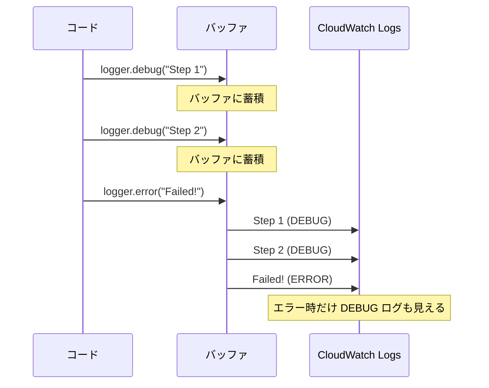
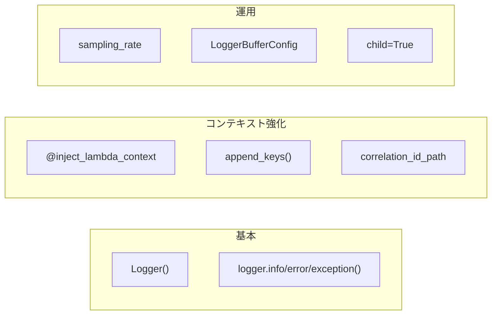

# 03. Logger — 構造化ロギング

## なぜ構造化ログが必要か

Lambda の標準 `print()` や `logging.info()` は**プレーンテキスト**で出力される。
CloudWatch Logs で大量のログを検索・分析するとき、テキストの grep では限界がある。

Powertools の Logger は **JSON 形式**で出力するため、CloudWatch Logs Insights で SQL ライクにクエリできる。

```
# プレーンテキスト（検索しにくい）
2024-01-15 10:30:00 INFO Processing kifu abc123 for user taro

# 構造化 JSON（フィールドで検索・集計できる）
{"level":"INFO","message":"Processing kifu","kifu_id":"abc123","username":"taro","timestamp":"2024-01-15T10:30:00Z","service":"backend-main"}
```

## 基本的な使い方

### 最小構成

```python
from aws_lambda_powertools import Logger

logger = Logger()  # サービス名は環境変数 POWERTOOLS_SERVICE_NAME から自動取得

def lambda_handler(event, context):
    logger.info("Hello")
    return {"statusCode": 200}
```

出力:

```json
{
  "level": "INFO",
  "location": "lambda_handler:5",
  "message": "Hello",
  "timestamp": "2024-01-15T10:30:00.000Z",
  "service": "backend-main"
}
```

### ShogiProject での使用

```python
# app.py
from aws_lambda_powertools import Logger

logger = Logger()

@app.exception_handler(Exception)
def handle_unexpected_error(ex: Exception):
    logger.exception("Unexpected error")  # スタックトレースも自動記録
    return Response(status_code=500, ...)
```

現状は例外ログのみだが、Logger の機能はもっと豊富。

## ログレベル

Python 標準の logging と同じ 5 段階:

```python
logger.debug("Detailed info")    # 開発時のみ
logger.info("Normal operation")  # 通常運用
logger.warning("Something odd")  # 警告
logger.error("Something failed") # エラー
logger.exception("With traceback") # エラー + スタックトレース
```

デフォルトは `INFO`。環境変数 `POWERTOOLS_LOG_LEVEL=DEBUG` で変更可能。

## Lambda コンテキストの自動注入

```python
from aws_lambda_powertools.utilities.typing import LambdaContext

logger = Logger()

@logger.inject_lambda_context
def lambda_handler(event: dict, context: LambdaContext):
    logger.info("Processing")
    return {"statusCode": 200}
```

`@logger.inject_lambda_context` を付けると、すべてのログに以下が自動追加される:

| フィールド | 内容 |
|-----------|------|
| `cold_start` | コールドスタートかどうか（`true`/`false`） |
| `function_name` | Lambda 関数名 |
| `function_memory_size` | メモリサイズ |
| `function_arn` | Lambda ARN |
| `function_request_id` | リクエスト ID |

コールドスタートの検出がログだけでできるのは便利。

## カスタムキーの追加

### 永続キー（以降のすべてのログに含まれる）

```python
logger.append_keys(order_id="12345", customer="taro")
logger.info("Processing order")  # order_id と customer が含まれる
logger.info("Order complete")    # ここにも含まれる
```

### 一時キー（そのログ行だけ）

```python
logger.info("Processing", extra={"kifu_id": "abc123"})
# → kifu_id はこの行のログにだけ含まれる
```

### コンテキストマネージャ（スコープ内だけ）

```python
with logger.append_context_keys(user_id="123"):
    logger.info("In context")   # user_id が含まれる
logger.info("Out of context")   # user_id は含まれない
```

## 相関 ID

マイクロサービス間でリクエストを追跡するための ID を自動抽出できる:

```python
from aws_lambda_powertools.logging import correlation_paths

@logger.inject_lambda_context(
    correlation_id_path=correlation_paths.API_GATEWAY_REST
)
def lambda_handler(event, context):
    logger.info("Processing")
    # → ログに "correlation_id": "abc-123-..." が自動付与
```

組み込みパス:
- `API_GATEWAY_REST` — `event.requestContext.requestId`
- `API_GATEWAY_HTTP` — `event.requestContext.requestId`
- `APPSYNC_RESOLVER` — `event.headers.x-amzn-trace-id`
- `EVENT_BRIDGE` — `event.id`

## ログサンプリング

本番で全リクエストの DEBUG ログを出すとコスト・量が膨大になる。
サンプリングで**一定割合だけ** DEBUG レベルに引き上げる:

```python
logger = Logger(sampling_rate=0.1)  # 10% のリクエストで DEBUG ログを出力
```

普段は INFO 以上だが、10% の確率で DEBUG も出る。本番のトラブルシュート用。

## ログバッファリング

通常は DEBUG ログを捨てるが、エラーが起きたときだけ遡って出力する:

```python
from aws_lambda_powertools.logging.buffer import LoggerBufferConfig

config = LoggerBufferConfig(max_bytes=20480, flush_on_error_log=True)
logger = Logger(level="INFO", buffer_config=config)

def lambda_handler(event, context):
    logger.debug("Step 1")  # バッファに保持（通常は出力されない）
    logger.debug("Step 2")  # バッファに保持
    logger.error("Something failed!")  # ← ここで Step 1, 2 もまとめて出力される
```



## 子ロガー

モジュール間でロガーを共有するとき、`child=True` で子ロガーを作る:

```python
# app.py
from aws_lambda_powertools import Logger
logger = Logger(service="backend-main")

# services/kifu_service.py
from aws_lambda_powertools import Logger
logger = Logger(service="backend-main", child=True)
# → 親ロガーの設定（ログレベル、永続キー等）を引き継ぐ
```

## まとめ: Logger でよく使うパターン



| やりたいこと | 使う機能 |
|-------------|---------|
| 基本的なログ出力 | `logger.info("message")` |
| Lambda 情報を自動付与 | `@logger.inject_lambda_context` |
| リクエスト追跡 | `correlation_id_path` |
| 追加情報をログに含める | `append_keys()` / `extra={}` |
| 本番で一部だけ DEBUG | `sampling_rate=0.1` |
| エラー時だけ DEBUG 出力 | `LoggerBufferConfig` |
| モジュール間共有 | `Logger(child=True)` |

## 次のステップ

- [04_tracer.md](04_tracer.md) — Tracer による分散トレーシング
