# 04. Tracer — 分散トレーシング

> **注**: ShogiProject では未使用。将来の導入検討のために紹介する。

## Tracer とは

AWS X-Ray SDK の薄いラッパー。Lambda 関数内の処理を**サブセグメント**として可視化し、どこに時間がかかっているかを把握できる。

```mermaid
gantt
    title X-Ray トレース例（Tracer で自動生成）
    dateFormat X
    axisFormat %s

    section Lambda
    lambda_handler          :0, 500

    section 関数呼び出し
    get_kifu()              :50, 200
    DB クエリ                :80, 180
    format_response()       :210, 280
```



## 基本的な使い方

```python
from aws_lambda_powertools import Tracer

tracer = Tracer()  # サービス名は環境変数 POWERTOOLS_SERVICE_NAME から取得

@tracer.capture_lambda_handler    # Lambda 全体をトレース
def lambda_handler(event, context):
    result = collect_payment(event["charge_id"])
    return {"statusCode": 200, "body": result}

@tracer.capture_method            # 個別の関数をトレース
def collect_payment(charge_id: str) -> str:
    # この関数の実行時間が X-Ray に記録される
    return f"payment collected for {charge_id}"
```

たった 2 つのデコレータ（`@capture_lambda_handler`, `@capture_method`）で X-Ray のサブセグメントが自動生成される。

## アノテーションとメタデータ

X-Ray のトレースに追加情報を付与する方法が 2 つある:

| | アノテーション | メタデータ |
|---|-------------|----------|
| **用途** | 検索・フィルタ用 | 詳細情報の記録用 |
| **X-Ray での検索** | 可能 | 不可 |
| **値の型** | 文字列・数値・Boolean のみ | 任意のオブジェクト |

```python
@tracer.capture_method
def process_kifu(kid: str):
    tracer.put_annotation(key="KifuId", value=kid)           # 検索可能
    tracer.put_metadata(key="kifu_data", value=large_dict)   # 詳細記録用
```

X-Ray コンソールで `annotation.KifuId = "abc123"` のように検索できる。

## レスポンス・エラーのキャプチャ制御

デフォルトでは、戻り値と例外が自動で X-Ray メタデータに記録される。
機密データが含まれる場合はオフにできる:

```python
@tracer.capture_lambda_handler(capture_response=False)  # 戻り値を記録しない
def lambda_handler(event, context):
    ...

@tracer.capture_method(capture_error=False)  # 例外情報を記録しない
def sensitive_operation():
    ...
```

## 非同期関数にも対応

```python
@tracer.capture_method
async def async_collect_payment(charge_id: str):
    await some_async_operation()
    return "done"
```

## ShogiProject に導入するとしたら

```python
# app.py
from aws_lambda_powertools import Logger, Tracer

logger = Logger()
tracer = Tracer()

@tracer.capture_lambda_handler
def lambda_handler(event, context):
    return app.resolve(event, context)

# repositories/db.py
from aws_lambda_powertools import Tracer

tracer = Tracer()

@tracer.capture_method
def execute_query(sql: str, params: dict):
    # DB クエリの実行時間が X-Ray で可視化される
    ...
```

必要なのは:
1. SAM テンプレートで `Tracing: Active` を設定
2. Lambda に X-Ray の IAM 権限を付与
3. デコレータを追加

## まとめ

| やりたいこと | 使う機能 |
|-------------|---------|
| Lambda 全体のトレース | `@tracer.capture_lambda_handler` |
| 個別関数のトレース | `@tracer.capture_method` |
| 検索用の情報追加 | `tracer.put_annotation()` |
| 詳細情報の記録 | `tracer.put_metadata()` |
| 機密データの除外 | `capture_response=False` |

## 次のステップ

- [05_metrics.md](05_metrics.md) — Metrics によるカスタムメトリクス
