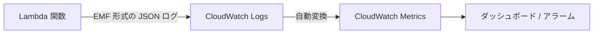

# 05. Metrics — CloudWatch カスタムメトリクス

> **注**: ShogiProject では未使用。将来の導入検討のために紹介する。

## Metrics とは

CloudWatch の **Embedded Metric Format (EMF)** を使って、Lambda のログ出力から自動的にカスタムメトリクスを生成する仕組み。

通常、CloudWatch メトリクスを作るには `put_metric_data` API を呼ぶ必要があるが、EMF を使うと**ログに特定の JSON 形式で書き出すだけ**で CloudWatch がメトリクスとして認識してくれる。Powertools はその JSON フォーマットの生成を自動化する。



## 基本的な使い方

```python
from aws_lambda_powertools import Metrics
from aws_lambda_powertools.metrics import MetricUnit

metrics = Metrics(namespace="ShogiProject", service="backend-main")

@metrics.log_metrics  # Lambda 終了時にメトリクスをフラッシュ
def lambda_handler(event, context):
    metrics.add_metric(name="KifuCreated", unit=MetricUnit.Count, value=1)
    return {"statusCode": 200}
```

**重要**: `@metrics.log_metrics` デコレータを付けないと、メトリクスがフラッシュされず記録されない。

## ディメンション

メトリクスをグループ化するためのキー:

```python
metrics.add_dimension(name="environment", value="prod")
metrics.add_metric(name="KifuCreated", unit=MetricUnit.Count, value=1)
# → "environment=prod" でフィルタできるメトリクスになる
```

### デフォルトディメンション

すべてのメトリクスに自動的に付与されるディメンション:

```python
metrics = Metrics(namespace="ShogiProject")
metrics.set_default_dimensions(environment="prod", service="backend-main")
```

## MetricUnit の種類

よく使うもの:

| ユニット | 用途 |
|---------|------|
| `MetricUnit.Count` | 回数（リクエスト数、エラー数等） |
| `MetricUnit.Milliseconds` | レスポンスタイム |
| `MetricUnit.Bytes` | データサイズ |
| `MetricUnit.Percent` | 割合 |

## コールドスタートメトリクス

```python
@metrics.log_metrics(capture_cold_start_metric=True)
def lambda_handler(event, context):
    ...
```

これだけで `ColdStart` メトリクスが自動記録される。ディメンションは `function_name` と `service`。

## 単一メトリクス（single_metric）

異なるディメンションのメトリクスを出力したいとき:

```python
from aws_lambda_powertools import single_metric

# 通常のメトリクスとは別のディメンションで記録
with single_metric(name="SpecialEvent", unit=MetricUnit.Count, value=1) as metric:
    metric.add_dimension(name="category", value="premium")
```

`Metrics` インスタンスのディメンションとは独立して使える。

## ShogiProject に導入するとしたら

```python
# app.py
from aws_lambda_powertools import Metrics
from aws_lambda_powertools.metrics import MetricUnit

metrics = Metrics(namespace="ShogiProject")

@metrics.log_metrics(capture_cold_start_metric=True)
def lambda_handler(event, context):
    return app.resolve(event, context)

# services/kifu_service.py — ビジネスメトリクスの例
def create_kifu(username: str, body: dict):
    kifu = kifu_repository.create(...)
    metrics.add_metric(name="KifuCreated", unit=MetricUnit.Count, value=1)
    return kifu

def delete_kifu(username: str, kid: str):
    kifu_repository.delete(...)
    metrics.add_metric(name="KifuDeleted", unit=MetricUnit.Count, value=1)
```

SAM テンプレートに環境変数を追加:

```yaml
Environment:
  Variables:
    POWERTOOLS_METRICS_NAMESPACE: ShogiProject
    POWERTOOLS_SERVICE_NAME: backend-main
```

## まとめ

| やりたいこと | 使う機能 |
|-------------|---------|
| メトリクスの定義 | `metrics.add_metric(name, unit, value)` |
| メトリクスのフラッシュ | `@metrics.log_metrics` |
| グループ化 | `metrics.add_dimension(name, value)` |
| コールドスタート計測 | `capture_cold_start_metric=True` |
| 別ディメンションで記録 | `single_metric()` |

## 次のステップ

- [06_other_utilities.md](06_other_utilities.md) — Validation, Idempotency, Parameters 等
