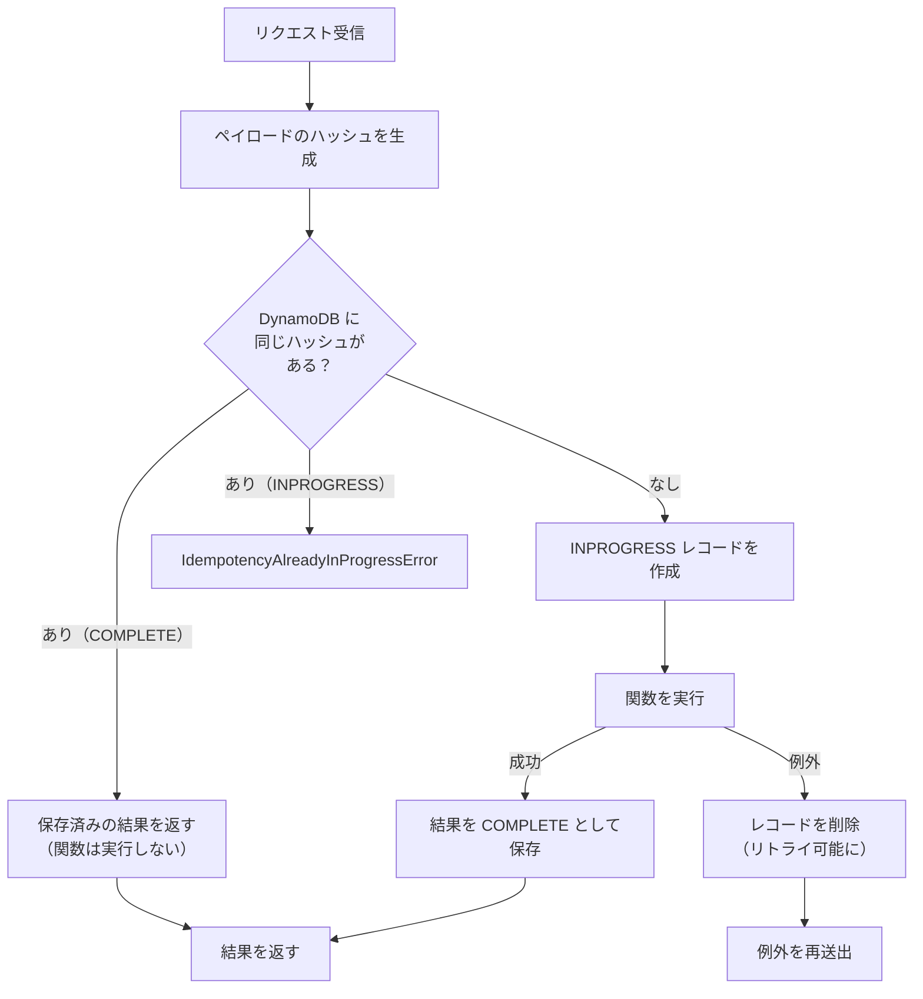
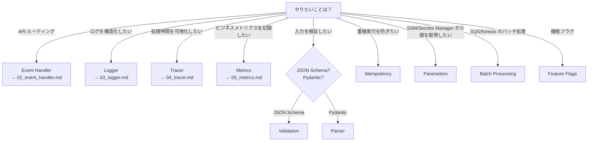

# 06. その他のユーティリティ

> **注**: いずれも ShogiProject では未使用。機能の概要と「どういうときに使うか」を把握するために紹介する。

## 1. Validation — JSON Schema によるバリデーション

### 何ができるか

イベント（リクエスト）やレスポンスを **JSON Schema** で自動検証する。
ShogiProject ではサービス層で手動バリデーションをしているが、Validation を使うとスキーマ定義だけで済む。

### 使い方

```python
from aws_lambda_powertools.utilities.validation import validator

INPUT_SCHEMA = {
    "$schema": "https://json-schema.org/draft/2020-12/schema",
    "type": "object",
    "properties": {
        "title": {"type": "string", "minLength": 1, "maxLength": 255},
        "sfen": {"type": "string"},
    },
    "required": ["title"],
}

@validator(inbound_schema=INPUT_SCHEMA)
def lambda_handler(event, context):
    # ここに到達する時点で event は検証済み
    return {"statusCode": 200}
```

スキーマに合わない入力が来ると `SchemaValidationError` が自動で raise される。

### スタンドアロン方式（デコレータを使わない）

```python
from aws_lambda_powertools.utilities.validation import validate, SchemaValidationError

def create_kifu(body: dict):
    try:
        validate(event=body, schema=KIFU_SCHEMA)
    except SchemaValidationError as e:
        raise ValidationError(str(e))
```

### エンベロープ（イベントの一部だけ検証）

API Gateway イベントの `body` 部分だけを検証したいとき:

```python
from aws_lambda_powertools.utilities.validation import envelopes

@validator(inbound_schema=BODY_SCHEMA, envelope=envelopes.API_GATEWAY_REST)
def lambda_handler(event, context):
    # event.body の JSON がスキーマで検証される
    pass
```

組み込みエンベロープ: `API_GATEWAY_REST`, `API_GATEWAY_HTTP`, `EVENTBRIDGE`, `SNS`, `SQS`, `KINESIS_DATA_STREAM`, `CLOUDWATCH_LOGS`

---

## 2. Idempotency — べき等性

### 何ができるか

同じリクエストが複数回来ても**1 回だけ処理し、同じ結果を返す**仕組み。
DynamoDB テーブルをバックエンドとして、処理済みリクエストのハッシュと結果を保存する。

ネットワーク障害やリトライで重複リクエストが発生しうる場面（決済処理、データ作成等）で有用。

### 処理フロー



### 使い方

```python
from aws_lambda_powertools.utilities.idempotency import (
    DynamoDBPersistenceLayer,
    IdempotencyConfig,
    idempotent,
)

persistence = DynamoDBPersistenceLayer(table_name="IdempotencyTable")
config = IdempotencyConfig(
    event_key_jmespath="body",          # べき等キーの抽出元
    expires_after_seconds=3600,         # 1 時間で期限切れ
)

@idempotent(config=config, persistence_store=persistence)
def lambda_handler(event, context):
    # 同じ body のリクエストは 2 回目以降スキップされる
    return create_payment(event)
```

### 関数レベルのべき等性

Lambda ハンドラ全体ではなく、特定の関数だけをべき等にする:

```python
from aws_lambda_powertools.utilities.idempotency import idempotent_function

@idempotent_function(
    data_keyword_argument="order",  # キーワード引数名を指定
    config=config,
    persistence_store=persistence,
)
def process_order(order: dict):
    return {"order_id": order["id"], "status": "processed"}

# 呼び出し側（キーワード引数で渡すこと）
result = process_order(order={"id": "123", "amount": 1000})
```

### 設定オプション

| パラメータ | デフォルト | 説明 |
|-----------|---------|------|
| `event_key_jmespath` | `""` | べき等キーを抽出する JMESPath 式 |
| `expires_after_seconds` | `3600` | レコードの有効期限（秒） |
| `use_local_cache` | `False` | Lambda 内のメモリキャッシュも使う |
| `raise_on_no_idempotency_key` | `False` | キーが見つからないとき例外を出すか |

### DynamoDB テーブルの要件

- パーティションキー: `id`（文字列型）
- TTL 属性: `expiration`（数値型）

---

## 3. Parameters — パラメータの取得とキャッシュ

### 何ができるか

AWS のパラメータストア（SSM Parameter Store, Secrets Manager, AppConfig 等）から値を取得し、**自動的にキャッシュ**する。

ShogiProject では環境変数（`os.environ`）で設定を管理しているが、機密情報の管理や動的な設定変更が必要な場合は Parameters が有用。

### 使い方

```python
from aws_lambda_powertools.utilities import parameters

# SSM Parameter Store から取得（5 分間自動キャッシュ）
db_endpoint = parameters.get_parameter("/sgp/prod/db-endpoint")

# Secrets Manager から取得
db_password = parameters.get_secret("/sgp/prod/db-password")

# JSON を自動パース
config = parameters.get_parameter("/sgp/prod/config", transform="json")
# → dict として返される
```

### キャッシュ制御

```python
# キャッシュ期間を変更（デフォルト 5 分）
value = parameters.get_parameter("/my/param", max_age=60)  # 60 秒

# キャッシュを無視して強制取得
value = parameters.get_parameter("/my/param", force_fetch=True)
```

### 複数パラメータの一括取得

```python
# /sgp/prod/ 配下のパラメータを全て取得
all_params = parameters.get_parameters("/sgp/prod/")
# → {"db-endpoint": "xxx", "db-name": "yyy", ...}
```

### プロバイダーの種類

| 関数 | ソース |
|-----|------|
| `get_parameter()` / `get_parameters()` | SSM Parameter Store |
| `get_secret()` | Secrets Manager |
| `get_app_config()` | AppConfig |

---

## 4. その他の機能（概要のみ）

### Batch Processing

SQS / Kinesis / DynamoDB Streams のバッチ処理で、**一部のレコードが失敗しても全体をリトライしない**ようにする。

```python
from aws_lambda_powertools.utilities.batch import BatchProcessor, EventType

processor = BatchProcessor(event_type=EventType.SQS)

def record_handler(record):
    # 各レコードを個別に処理
    payload = record.body
    process(payload)

def lambda_handler(event, context):
    batch = event["Records"]
    with processor(records=batch, handler=record_handler):
        processed_messages = processor.process()
    return processor.response()  # 失敗したレコードだけ SQS に戻す
```

### Parser（Pydantic ベース）

Pydantic モデルでイベントをパースする。JSON Schema の Validation と似ているが、Pydantic の型システムが使える:

```python
from aws_lambda_powertools.utilities.parser import event_parser, BaseModel

class KifuInput(BaseModel):
    title: str
    sfen: str | None = None

@event_parser(model=KifuInput)
def lambda_handler(event: KifuInput, context):
    print(event.title)  # 型安全にアクセス
```

### Feature Flags

AppConfig をバックエンドとした機能フラグ:

```python
from aws_lambda_powertools.utilities.feature_flags import FeatureFlags, AppConfigStore

app_config = AppConfigStore(environment="prod", application="sgp", name="features")
feature_flags = FeatureFlags(store=app_config)

if feature_flags.evaluate(name="new_analysis_engine", default=False):
    # 新しい分析エンジンを使う
    ...
```

### Data Masking

ログやトレースに含まれるデータの機密フィールドをマスクする。

### Streaming

S3 の大きなファイルを Lambda のメモリに全部載せずにストリーム処理する。

---

## 機能選択ガイド



## まとめ

Powertools は「Lambda で API を作るときに必要になるものを一通り揃えたツールキット」。
全部使う必要はなく、**必要な機能だけ import すれば OK**。

ShogiProject では Event Handler と Logger だけを使っているが、以下の場面で追加機能の導入を検討する価値がある:

| 場面 | 検討する機能 |
|------|-------------|
| パフォーマンス問題の調査 | Tracer |
| 利用状況の把握（棋譜作成数等） | Metrics |
| 入力バリデーションの標準化 | Validation or Parser |
| 決済等の重複防止 | Idempotency |
| 機密情報の管理強化 | Parameters |
