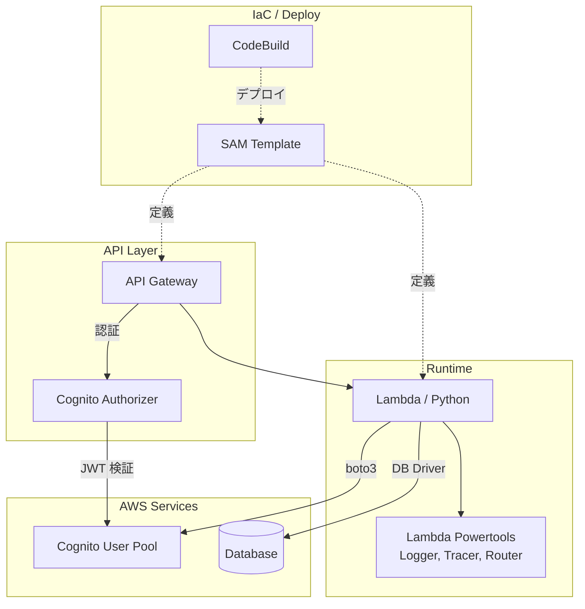

# 技術方針

## 概要

本ドキュメントは、このバックエンドマイクロサービスの技術方針（技術選定・ライブラリ・各種ポリシー）を定める。
システム全体の構成・レイヤー方針については [docs/technical_policies.md](../../../docs/technical_policies.md) を参照。

---

## 技術スタック概要

---

## ランタイム・言語

| 項目 | 選定 | 理由 |
|------|------|------|
| 言語 | Python 3.13 | Lambda ネイティブサポート。型ヒントが充実 |
| 実行環境 | AWS Lambda | サーバーレスで運用負荷が低い |
| 構成 | Lambdalith（単一 Lambda） | エンドポイント増加時にデプロイ単位を変えずに済む |

---

## フレームワーク・ライブラリ

### コア

| ライブラリ | 用途 | 選定理由 |
|-----------|------|---------|
| aws-lambda-powertools | ルーティング・ログ・トレーシング | Lambda 向け統合ツールキット。AWS 公式サポート |
| boto3 | AWS サービス操作 | AWS SDK 標準 |

### 【DB】データベースドライバ

| ライブラリ | 用途 | 選定理由 |
|-----------|------|---------|
| psycopg\[binary,pool\] | PostgreSQL ドライバ | Python 向け標準的な PostgreSQL ドライバ |
| aurora-dsql-python-connector | Aurora DSQL 接続 | IAM 認証による接続を提供 |

### 開発・テスト

| ライブラリ | 用途 |
|-----------|------|
| pytest | テストフレームワーク |
| moto\[cognitoidp\] | AWS サービスモック |
| pytest-postgresql | 【DB】ローカル PostgreSQL テスト |

---

## 認証

- **認証プロバイダ**: Cognito User Pool（全体インフラで管理）
- **認証レイヤー**: API Gateway の Cognito Authorizer で JWT を検証する。Lambda 側での独自検証は行わない
- **ユーザー識別**: JWT クレームの `cognito:username` を使用する
- **認証不要エンドポイント**: API Gateway の Authorizer 設定で `NONE` を指定する
- **Cognito 管理操作**: Lambda から boto3 経由で Cognito 管理操作を行う。必要最小限の IAM 権限のみ付与する

認証フロー全体の詳細と実装例は [docs/reference/authentication.md](../../../docs/reference/authentication.md) を参照。

---

## 【DB】データベース

| 項目 | 選定 | 理由 |
|------|------|------|
| DBMS | Aurora DSQL（PostgreSQL 互換） | サーバーレス。マルチリージョン対応 |
| 認証方式 | IAM 認証（パスワードレス） | シークレット管理が不要 |
| 接続方式 | グローバル接続の再利用 | Lambda ウォームスタート時の接続コスト削減 |

### 接続ポリシー

- `autocommit=True` をデフォルトとし、複数操作が必要な場合のみ明示的にトランザクションを使用する
- 接続がクローズされた場合は自動的にリコネクトする
- 接続情報（エンドポイント等）は環境変数で注入する

---

## 【DB】マイグレーション

- マイグレーションスクリプトで SQL ファイルを順次実行する
- 全 DDL に `IF NOT EXISTS` / `IF EXISTS` を付与し、冪等性を保証する
- デプロイパイプラインの `post_build` フェーズで自動実行する

> **Aurora DSQL 固有**: 1 トランザクションにつき DDL は 1 つまで。`-- STATEMENT` コメントで区切り、各 DDL を別トランザクションで実行する。

---

## IaC・デプロイ

| 項目 | 選定 | 理由 |
|------|------|------|
| IaC | SAM (Serverless Application Model) | Lambda + API Gateway を一体管理できる |

### デプロイポリシー

- 環境（`dev` / `pro`）はパラメータで切り替える
- ビジネスロジックに関わる上限値（クォータ）はパラメータとして外出しし、コード変更なしで調整可能にする
- 共通インフラ（Cognito 等）の情報は CloudFormation のエクスポート値を `ImportValue` で参照する
- Lambda の IAM 権限は必要最小限（Least Privilege）に設定する

### CI/CD における責務分担

本ユニットの CI/CD に関する責務は **`buildspec.yml` の定義のみ**である。

| 責務 | 担当 |
|------|------|
| CodeBuild プロジェクトの作成・管理 | CI/CD ユニット |
| 環境変数（`ENV` 等）の注入 | CI/CD ユニット → CodeBuild 環境変数 |
| ビルド・デプロイ手順の定義 | 本ユニット（`buildspec.yml`） |

`buildspec.yml` は CI/CD ユニットから注入される環境変数を前提とする。環境変数の定義やユニット間の受け渡し仕様は上位の契約ドキュメントに従うこと。

---

## エラーハンドリング

- ベースとなる例外クラスを設け、HTTP ステータスコードに対応するサブクラスを定義する
- ハンドラ層でグローバルにキャッチし、統一されたエラーレスポンスを返す。レスポンス形式は [docs/openapi_main.yaml](../../../docs/openapi_main.yaml) に従う
- **ビジネスロジック層**: 例外のサブクラスを送出する。HTTP の詳細は知らない
- **ハンドラ層**: 例外をキャッチしてエラーレスポンスに変換する
- **予期しないエラー**: 500 を返し、スタックトレースをログに記録する。クライアントには詳細を公開しない

---

## ログ・トレーシング

| 機能 | ツール | 説明 |
|------|--------|------|
| ログ | Lambda Powertools Logger | 構造化 JSON ログ |
| トレーシング | Lambda Powertools Tracer | X-Ray によるトレース |

### ログポリシー

- リクエスト単位の構造化ログを出力する
- ログレベルは環境変数で制御する
- 予期しないエラーはスタックトレースを含めて記録する
- 機密情報（トークン、パスワード等）はログに出力しない

### トレーシングポリシー

- Lambda ハンドラ全体をトレースする
- サービス名は環境変数で設定する

---

## 環境変数

- 設定値はすべて環境変数で注入する。コード内でのハードコードは禁止する
- 他ユニットから受け取る値（`ImportValue` 等）のキー名や受け渡し方法は [docs/units_contracts.md](../../../docs/units_contracts.md) に従うこと

---

## テスト

### テスト方針

- **ローカルテスト**: AWS 認証不要。モック（moto）を使用してオフラインで実行可能にする
- **結合テスト**: 実際の AWS リソースに接続して実行する。CI/CD 環境での実行を前提とする

### 【DB】DB テストの方針

- ローカルテストでは `pytest-postgresql` でローカル PostgreSQL を使用する
- 結合テストでは実際のデータベースに接続する
